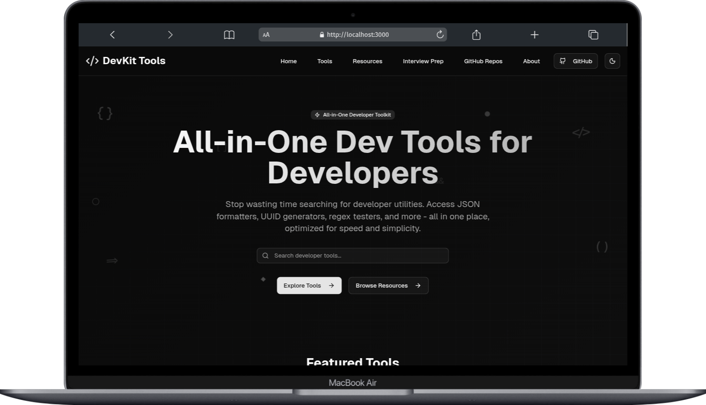

# DevKit Tools 

A comprehensive, all-in-one developer utilities platform built with Next.js 15, featuring 10+ essential tools that every developer needs. Fast, responsive, and completely free to use.



## 🎨 User Experience

- **Dark/Light Mode** - Seamless theme switching with system preference detection
- **Responsive Design** - Optimized for desktop, tablet, and mobile devices
- **Search & Filter** - Real-time search across all tools with query highlighting
- **Favorites System** - Save frequently used tools with localStorage persistence
- **Copy to Clipboard** - One-click copying for all tool outputs

### 🚀 Technical Features

- **SEO Optimized** - Complete meta tags, sitemap, and structured data
- **Fast Performance** - Optimized with Next.js 15 App Router and React Server Components
- **Error Handling** - Comprehensive error boundaries and user-friendly error messages

## 🚀 Quick Start

### Prerequisites

- Node.js 22+
- npm, yarn, pnpm or bun

### Installation

1. **Clone the repository**

   ```bash
   git clone https://github.com/maruf-pfc/devkit-tools.git
   cd devkit-tools
   ```

2. **Install dependencies**

   ```bash
   pnpm install
   ```

3. **Run the development server**

   ```bash
   pnpm dev
   ```

4. **Open your browser**
   Navigate to [http://localhost:3000](http://localhost:3000)

## 🛠️ Built With

### Core Technologies

- **[Next.js 15](https://nextjs.org/)** - React framework with App Router
- **[TypeScript](https://www.typescriptlang.org/)** - Type-safe JavaScript
- **[Tailwind CSS](https://tailwindcss.com/)** - Utility-first CSS framework
- **[React 19](https://reactjs.org/)** - UI library with concurrent features

### UI Components & Styling

- **[shadcn/ui](https://ui.shadcn.com/)** - High-quality React components
- **[Lucide React](https://lucide.dev/)** - Beautiful & consistent icons
- **[next-themes](https://github.com/pacocoursey/next-themes)** - Theme management

### Development Tools

- **[ESLint](https://eslint.org/)** - Code linting
- **[Prettier](https://prettier.io/)** - Code formatting

## 🤝 Contributing

We welcome contributions! Please see our [Contributing Guide](./CONTRIBUTING.md) for details.

### Development Workflow

1. **Fork the repository**
2. **Create a feature branch**
   ```bash
   git checkout -b feature/amazing-tool
   ```
3. **Make your changes**
4. **Add tests if applicable**
5. **Commit your changes**
   ```bash
   git commit -m "Add amazing new tool"
   ```
6. **Push to your fork**
   ```bash
   git push origin feature/amazing-tool
   ```
7. **Create a Pull Request**

## 📝 License

This project is licensed under the MIT License - see the [LICENSE](LICENSE) file for details.

## 🙏 Acknowledgments

- [Vercel](https://vercel.com) for hosting and deployment
- [shadcn](https://twitter.com/shadcn) for the amazing UI components
- [Lucide](https://lucide.dev) for the beautiful icons
- The open-source community for inspiration and feedback

## 🔗 Links

- **Live Demo**: [https://devkit-tools.vercel.app](https://devkit-tools.vercel.app)
- **GitHub**: [https://github.com/maruf-pfc/devkit-tools](https://github.com/maruf-pfc/devkit-tools)
- **Issues**: [https://github.com/maruf-pfc/devkit-tools/issues](https://github.com/maruf-pfc/devkit-tools/issues)
- **Discussions**: [https://github.com/maruf-pfc/devkit-tools/discussions](https://github.com/maruf-pfc/devkit-tools/discussions)

**Made with ❤️ by Md. Maruf Sarker**

_Star ⭐ this repository if you find it helpful!_

## ⭐ Star History

[](https://www.star-history.com/#maruf-pfc/devkit-tools&Date)
